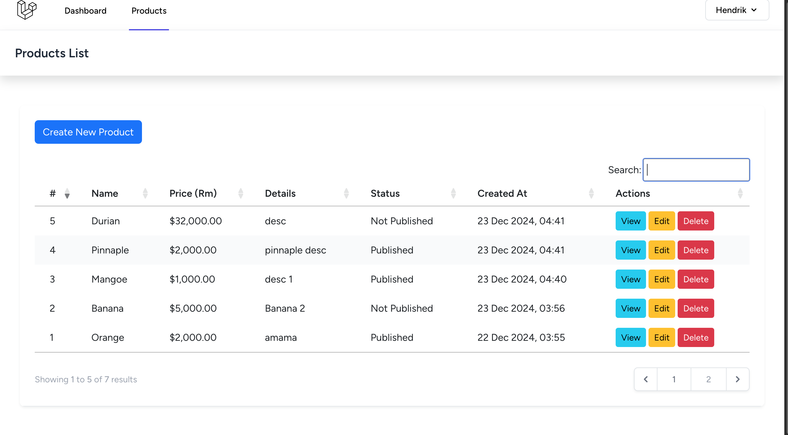

The Laravel framework is open-sourced software licensed under the [MIT license](https://opensource.org/licenses/MIT).
- if want to create fresh data
    - php artisan migrate:refresh
    - php artisan migrate
    - php artisan optimize
    - php artisan serve

    
